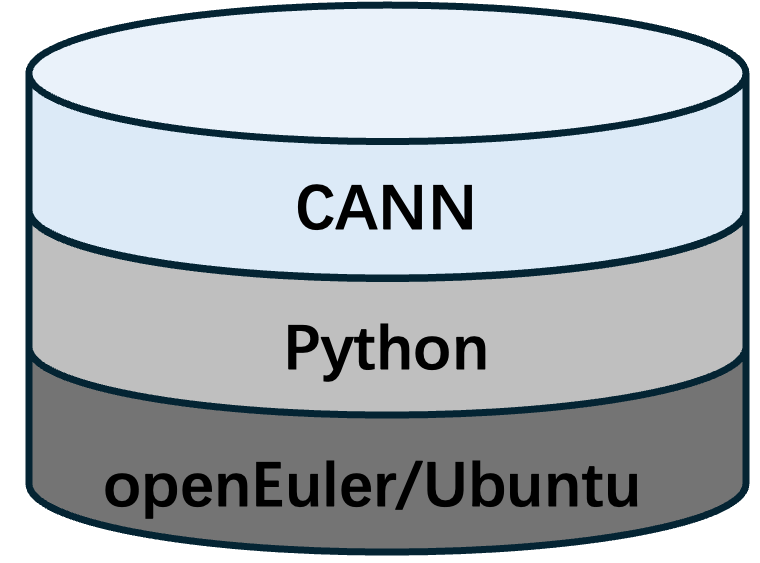
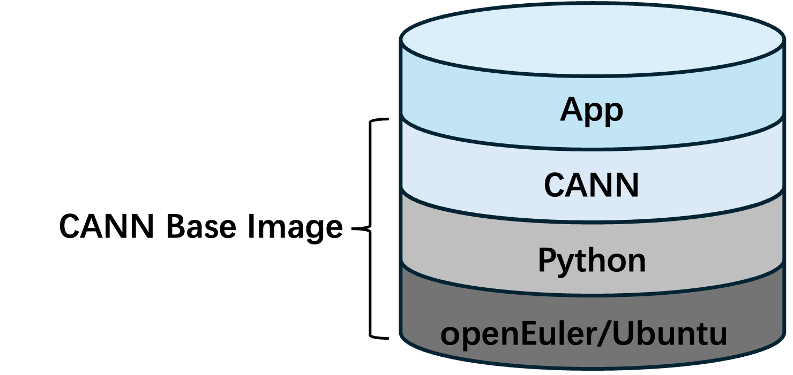

# CANN容器镜像规范

## 背景介绍
目前，[昇腾社区](https://www.hiascend.com/developer/download/community/result)以多种格式（如 `.run`、`.deb`、`.rpm`、`.zip`、`.tar.gz`）发布 CANN 的 Toolkit 开发套件、Kernels 算子包以及 NNAL 加速库包。用户需要花费大量时间下载并安装合适的软件包，使用体验较为繁琐。

为提升用户体验，本项目基于 Ubuntu 和 openEuler 操作系统构建包含 Python 与 CANN（Toolkit 开发套件、Kernels 算子包、NNAL 加速库）的容器镜像，并将这些镜像发布至 AscendHub、DockerHub 和 Quay.io 三大主流容器平台，同时提供版本匹配的 Dockerfile 作为参考模板，帮助用户实现“开箱即用”。

## 用户案例
- **作为 CANN 用户**：希望在新版本 CANN 发布后能够第一时间体验并快速投入使用；
- **作为昇腾社区上游支持者**：希望基于 CANN 镜像构建新的应用容器镜像，以便开发者能够快速验证其功能。

## 1. CANN 基础容器镜像
### 标签命名规则
CANN 基础容器镜像标签遵循统一格式：  
`<cann-version>-<chip>-<os><os-version>-<py-version>`  
 


**版本命名示例说明**：
- CANN alpha 版本：`8.1.rc1.alpha001`
- CANN beta 版本：`8.1.rc1`（不带 `beta1` 后缀）
- Python 版本：`py3.11`

**完整标签示例**：  
`8.1.rc1-910b-openeuler22.03-py3.11` 表示基于 openEuler22.03，包含 CANN 8.1.RC1.beta1、Python 3.11，适配 Ascend 910B 芯片的镜像。

### 特殊标签
| 标签               | 对应完整标签                                | 说明                                                                                       |
|--------------------|--------------------------------------------|-------------------------------------------------------------------------------------------|
| `8.2.rc1.alpha001` | `8.2.rc1.alpha001-910b-ubuntu22.04-py3.11` | 基于 Ubuntu22.04 构建的 包含 Python3.11、CANN 8.2.RC1.alpha001, 适配 Ascend 910B 芯片的镜像 |
| `8.2.rc1`          | `8.2.rc1-910b-ubuntu22.04-py3.11`          | 基于 Ubuntu22.04 构建的 包含 Python3.11、CANN 8.2.RC1.beta1, 适配 Ascend 910B 芯片的镜像    |
| `latest`           | `8.x.x-910b-ubuntu22.04-py3.11`            | 基于 Ubuntu22.04 构建的 包含 Python3.11、CANN最新版本, 适配 Ascend 910B 芯片的镜像           |

## 镜像获取地址
CANN 基础容器镜像已发布至以下仓库：
- **Quay.io**：  
  https://quay.io/repository/ascend/cann
- **DockerHub**：  
  https://hub.docker.com/r/ascendai/cann
- **AscendHub**：  
  https://www.hiascend.com/developer/ascendhub/detail/cann

## 注意事项
1. **环境变量设置**：
   - CANN 的环境变量通过 `ENV` 指令定义在 Dockerfile 中
   - NNAL 包的 `ATB_HOME_PATH` 由 `torch.compiled_with_cxx_abi()` 决定：
     ```bash
     if [true]; then ATB_HOME_PATH=/usr/local/Ascend/nnal/atb/latest/atb/cxx_abi_0
     else ATB_HOME_PATH=/usr/local/Ascend/nnal/atb/latest/atb/cxx_abi_1
     ```
   - 默认设置：`ATB_HOME_PATH=/usr/local/Ascend/nnal/atb/latest/atb/cxx_abi_0`

2. **启动配置**：
   - 在 `bashrc` 和 `ENTRYPOINT` 中添加：
     ```bash
     source /usr/local/Ascend/nnal/atb/set_env.sh
     ```
   - **双重保障机制**：
     - `ENTRYPOINT` 确保 `docker run image bash` 启动时环境变量生效
     - `bashrc` 确保 `docker run -d` `docker exec -it container bash` 交互时环境变量生效

## 2. CANN 应用容器镜像
任何在 CANN 基础容器镜像之上，包含依赖于 CANN 实现特定功能软件（集合）的镜像均认为是 CANN 的应用容器镜像。

本仓库不提供、发布任何 CANN 的应用容器镜像，本章节内容仅提供应用镜像发布参考。

### 标签命名规则
CANN 应用容器镜像标签建议参考以下格式：  
```
<app-version>-<chip>-<os>
```  
以 [vLLM-Ascend](https://github.com/vllm-project/vllm-ascend) 应用镜像标签为例：



`v0.11.0rc1-a3-openeuler` 表示基于 CANN 基础镜像，包含 vllm-ascend `v0.11.0rc1` 版本的应用镜像，适用运行于昇腾A3系列平台。

### 应用镜像发布渠道
欢迎广大开发者将 CANN 应用容器镜像同步到 [quay.io/ascend/{app-name}](https://quay.io/repository/ascend/) 仓库，如有此需求请在本仓库提交Issue申请。